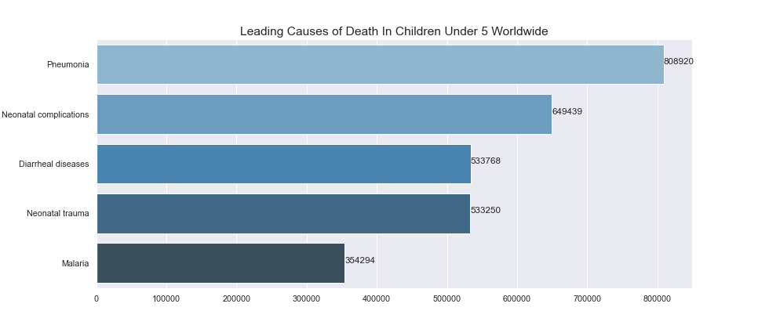
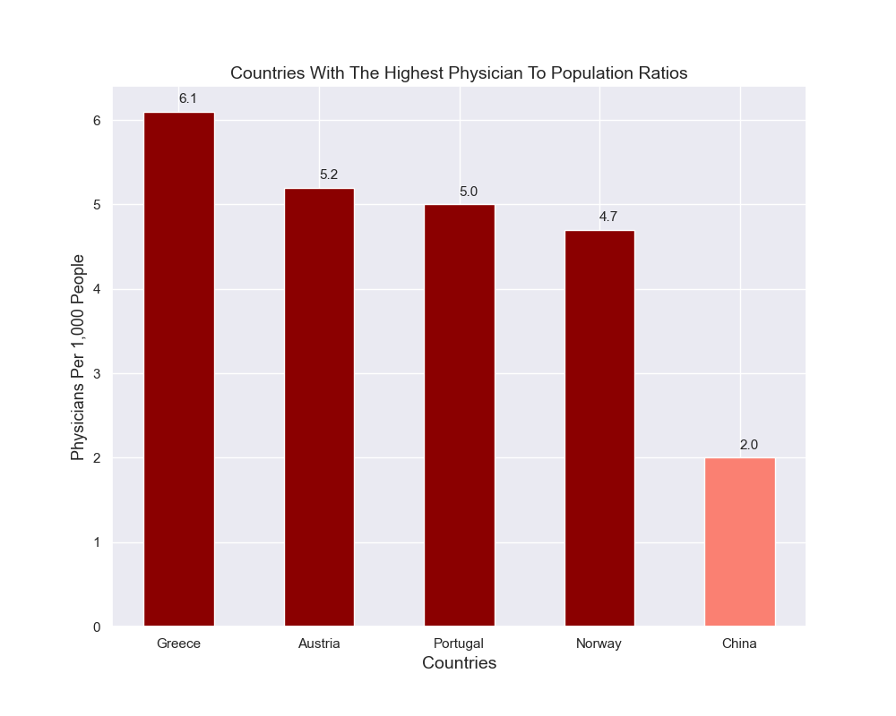

#  Identifying Pneumonia in Guangzhou Children Ages 0-5
Samantha Baltodano

## Table of Contents
* [Overview](#overview)
* [Business Understanding](#business-understanding)
* [Method](#method)
* [Analysis](#analysis)
* [Predictive Models](#predictive-models)
* [Conclusions](#conclusions)
* [Contributors](#contributors)

## Repository Links
* [Images](/Visuals)

## Overview
For this project I evaluated a [dataset](https://www.kaggle.com/paultimothymooney/chest-xray-pneumonia) of 5,856 X-Ray images of children under the age of 5 in Guangzhou, China. 4,273 of the chrildren were infected with pneumonia and the remainder of children were not infected with pneumonia. I conducted industry research to better understand the business problem, cleaned and processed the X-Rays for classification, and utilized Convulutional Neural Networks to identify whether or not a child had deveolped pneumonia. I then compare their performance on unseen images to decide on a final predictive model that optimized recall, due to the detrimental effects a false negative diagnosis would have on a child's mortality. My final model utilized `keras` Convolutional Neural Network and achieved a recall of 94%.

## Business Understanding

I have been employed by the Guangzhou Women and Children's Medical Center to identify areas of concern in hospital performance and determine creative solutions to address the problems I have found. Given the data I had available to me, I have chosen to address the medical center's diagnoses of children with pneumonia under 5.

Pneumonia is the single leading cause of death globally among children under 5 years of age accounting for over [800,000 deaths annually](https://ourworldindata.org/child-deaths-from-pneumonia). In China specifically, it is estimated that 2.5 million people a year are diagnosed and pneumonia is the cause of 17% of all child deaths in the nation. As alarming as these numbers seem, they draw added concern when you are aware that pneumonia mortality is completely preventable. This raised the question: why are so many infants dying from a curable illness? 

## Method

I first cleaned and processed my data to prepare for modeling. I corrected the image imbalance by utilizing image augmentation for all of my models to ensure that my minorty class is properly represented. If my model just predicted that a child had pneumonia every single time, I would have a model that was accurate 74% of the time with a recall of 100%. As I move forward with my modeling this is the number that I will need my model to beat. 

#### Treating Type Errors
In dealing with type errors, i.e the balance between false negatives and false positives in my models, I decided that it would cause more harm to incorrectly diagnose a child as not having pnuemonia when they actually have been infected (false negative) than it would be to diagnose a child with no pnuemonia as having pnuemonia (false positive). Given the expedient onset of pnuemonia syptoms and possibly death, I will be optimizing recall so as to minimze my false negatives moving forward.

## Analysis
Time is the biggest enemy to a child diagnosed with pneumonia. In severe case, the victim can die within hours, the lungs fill with fluid and the patient effectively drowns. The Guangzhou Women and Children's Medical Center must diagnose and treat these infants as quickly as possible to prevent unneccessary deaths. Unfortunately, China like so many other countries are facing a [severe physician shortage](https://www.projecthope.org/the-global-health-worker-shortage-10-numbers-to-note/02/2020/). It is estimated that by the end of the decade, in a world where we will need a sum total of 80 million physicians globally to properly treat the growing population, the worl will be short some 18 million. As it stands right now, China has approximately 2 physicians for every 1,000 members of their population. Depicted below is the physician to population ratio for China against the top 4 countries with the best ratios. Portugal and Denmark have around 2.5x more physicians to treat their populations than China does and those countries too are considered to be in a physician deficeit. 

Current physicians are overworked, fatiqued, and burnt out trying to adequately treat the growing volume of patients. It is not enough to say that we need to increase the physician to population ratio when globally, the majority of countries are facing a similar struggle. Luckily the answer is simple, cheap, and has already been created: Artifical Intelligence. On average, machine learning disease and illness diagnoses classifiers are just as accurate as radiologists, accurately classifying patients 87% of the time comapred to the 86% accuracy of the human eye. This prompted me to build a machine learning classifier to diagnose patients under 5 as having or not having pneumonia. My modeling went as follows.

## Predictive Models

I built several CNN models, tweaking features such as the number of hidden layers, dropouts, the number of nodes in a hidden layer, and the dropout. My final CNN model finished with a 99% recall and a 90% accuracy. This neural networks accuracy is 3% higher than average.

## Conclusions
My final model performed at a 99% recall with a 90% accuracy. As it currently stands, I do believe this neural network model could be deployed to help save the lives of more children with pneumonia by diagnosing patients earlier and pushing the more urgent cases to the front of the radiologists workload. 

## Contributors
- Samantha Baltodano  
    Github: [sbaltodano](https://github.com/sbaltodano) 
